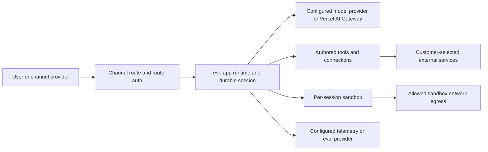

Your eve agent runs across two contexts, with a trust boundary between them and every secret kept on the trusted side. Use this mental model when deciding what an agent (and the model driving it) is allowed to reach.

## Trust boundaries

|                         | App runtime  | Sandbox               |
| ----------------------- | ------------ | --------------------- |
| `process.env` / secrets | Yes          | No                    |
| Your Node.js code       | Yes          | No                    |
| Network                 | Unrestricted | Controlled by policy  |
| Filesystem              | App's own    | Isolated `/workspace` |

The app runtime is the trusted side. Your tool implementations, model calls, connections, state, and durable execution all run here, with `process.env` and full Node.js available. (On Vercel, this is a Vercel Function.)

The sandbox is the isolated side. The model runs shell commands there through the built-in `bash`, `read_file`, `write_file`, `glob`, and `grep` tools. It gets its own `/workspace` filesystem, but no `process.env`, no secrets, and no path back into the app runtime. (On Vercel, each sandbox is a [Vercel Sandbox](https://vercel.com/docs/sandbox) microVM with hardware-level isolation.) Only shell commands execute in the sandbox. Even the built-in `bash`/`read_file`/`write_file` tools live in the app runtime and _proxy_ into the sandbox. The model sees tool definitions and results, never your secrets.

A concrete trace makes the boundary clear. When the model calls a custom `charge_card` tool, its `execute` runs in the app runtime, reads `process.env.STRIPE_KEY`, calls Stripe, and returns `{ ok: true }`. The model sees only `{ ok: true }`: the key never leaves the app runtime, and nothing about the call touches the sandbox. The built-in `write_file` is the mirror image, running in the app runtime and proxying the write into the sandbox `/workspace`. Either way the model drives the work through tool calls and their results, never by holding a credential or reaching the runtime directly.

## Data flow at a glance

eve sends data where your agent configuration and runtime choices send it:

- Inbound channel data flows through the channel provider you configure, then into the eve app runtime.
- Model inputs and outputs flow to the model or routing path selected in `agent.ts`, such as a Vercel AI Gateway model id or a provider-authored `LanguageModel`.
- Tool and connection calls flow to the external services, MCP servers, OpenAPI endpoints, and channels you configure.
- Sandbox commands can reach network destinations allowed by the sandbox network policy.
- Telemetry and eval data flows to the exporters and providers you configure in `instrumentation.ts` or eval settings.

eve stores durable session and workflow state needed to resume conversations, stream events, replay completed steps, and show run observability. You are responsible for deciding whether the selected channels, model providers, connected services, sandbox egress destinations, telemetry exporters, retention settings, and deletion controls are appropriate for your data and use case.

## Credential brokering

Credential brokering gives the model _authenticated_ network access from inside the sandbox, like a `git clone` of a private repo or an authenticated `curl`, when there's no [tool](../tools) or [connection](../connections) to route it through. On the Vercel Sandbox backend, auth headers get injected at the sandbox's network firewall for matching domains. The secret stays in the app runtime; the sandbox process only ever sees the response. See [Vercel Sandbox Credential Brokering](https://vercel.com/docs/sandbox/concepts/firewall#credentials-brokering) for the platform mechanism, and [Sandbox](../sandbox) for the eve policy API.

## Connection credentials

[Connection](../connections) tokens (MCP and OpenAPI) come from either `getToken()` or an interactive OAuth flow, and eve injects the resolved token into every outbound request. The token is cached per step and never serialized to durable state.

## Outbound requests are SSRF-guarded

Several eve surfaces make outbound HTTP requests to a host that comes from author, tenant, or model input rather than being hardcoded: [OpenAPI](../connections/openapi) spec fetches and credentialed operation calls, the built-in `web_fetch` tool, [MCP](../connections/mcp) connections, remote [subagent](../subagents) dispatch, OIDC discovery, and session callbacks. Left unguarded, any of these could be steered at an internal-only service or a cloud metadata endpoint (`169.254.169.254`) — and because some carry the connection's credentials, that would make an authenticated request on an attacker's behalf.

This protection is on by default; the author configures nothing. For every request eve issues on those surfaces, it:

- **Pins the transport to `https`.** Plain `http` is allowed only for loopback hosts, so local development still works but a credentialed call never runs over cleartext.
- **Resolves the host and blocks private ranges.** The hostname is DNS-resolved and rejected if it is — or resolves to — a private (RFC 1918), carrier-grade-NAT, link-local (including cloud metadata), or otherwise reserved address. A public-looking hostname that resolves into a private range is caught, not just IP literals.
- **Re-validates every redirect hop.** Redirects are followed manually and each hop runs the same checks, and `Authorization`/`Cookie` are dropped when a redirect crosses origin, so a safe first hop can't bounce the request (and its credentials) to an internal host.
- **Bounds the request** with a timeout and a response-size cap.

Two things to know:

- **Loopback is allowed by default.** `localhost` and `127.0.0.0/8` are treated as same-host, not a network pivot, because local development depends on them. The high-value target — link-local cloud metadata — is still blocked.
- **Your own code is not automatically covered.** The guard applies to eve's built-in request paths. A custom [tool](../tools) or handler that calls `fetch()` directly reaches whatever host it is given; validate untrusted URLs yourself before fetching them.

## Channel verification

A [channel](../channels/overview) is your agent's front door, so authenticating inbound traffic is its job. The built-in platform channels follow two rules, and so must any channel you write yourself:

- **Verify signatures in constant time.** Platform channels (Slack, GitHub,
  Telegram, Twilio) verify the platform's HMAC signature over the raw request body
  with a constant-time comparison, so timing the response can't reveal a forged
  signature. Use a constant-time compare for any secret you check, never `===` on
  a signature.
- **Don't trust body-supplied identity.** Derive the caller from a _verified_
  signature or token, never from a `principalId` (or similar) the request body
  claims. A body field is attacker-controlled; treating it as identity is
  cross-user impersonation.

A custom channel that accepts dashboard-style webhooks should follow the same shape: authenticate the raw body with an HMAC, compare signatures in constant time, and trust any body-supplied principal only after the signature verifies.

## Authored markdown is data

[Skill](../skills) and [schedule](../schedules) files are markdown with YAML frontmatter, and eve treats that frontmatter strictly as data. The code-capable engines (`---js` / `---javascript`, which would `eval()` the frontmatter body the moment the file is parsed) are disabled, so such a fence throws rather than running. Frontmatter has to parse to a plain YAML object.

## Auth fails closed

Routes reject unauthenticated traffic by default. If no `AuthFn` in the walk accepts the request, it gets a `401`, and admitting anonymous callers takes an explicit `none()`. The scaffold's `placeholderAuth()` keeps a half-configured app closed in production until you replace it. See [Auth & route protection](../guides/auth-and-route-protection) for the full walk and verifiers.

## Pre-production checklist

Before exposing an agent to real traffic:

- [ ] Replace `placeholderAuth()` in `agent/channels/eve.ts` with a real
      `AuthFn` (`vercelOidc()`, `httpBasic()`, `oidc()`, or your own). Verify an
      unauthenticated production request gets `401`.
- [ ] Verify channel signatures. Each platform channel needs its signing
      secret set; custom channels must verify signatures in constant time and never
      trust body-supplied identity.
- [ ] Keep secrets in `process.env`, never in compiled artifacts, never
      passed into the sandbox. Route privileged calls through tools or connections.
- [ ] Scope connection tokens to the least privilege the agent needs; they
      reach hosts but never the model.
- [ ] Set a sandbox network policy tighter than `allow-all` if the model
      shouldn't have open egress; use credential brokering for authenticated egress.
- [ ] Don't surface untrusted text as markup. Model- or user-controlled
      strings rendered into a channel UI should be escaped for that surface.
- [ ] Validate outbound URLs in your own tools. eve's built-in request paths
      are SSRF-guarded, but a custom tool that fetches an author-, tenant-, or
      model-supplied URL must validate it before fetching.

## What to read next

- [Auth & route protection](../guides/auth-and-route-protection): the full auth walk and verifier helpers
- [Sandbox](../sandbox): backends, network policy, and brokering config
- [Execution model and durability](./execution-model-and-durability): how durable sessions run
- [Connections](../connections): static-token and OAuth connections
