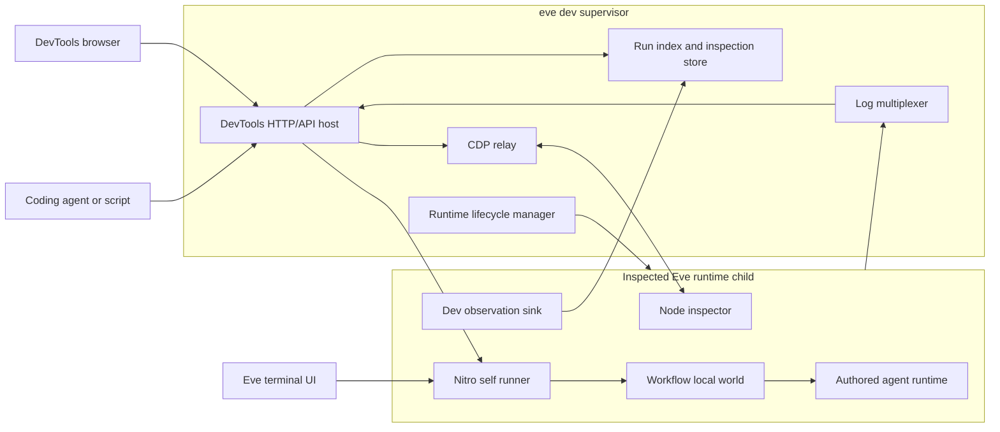
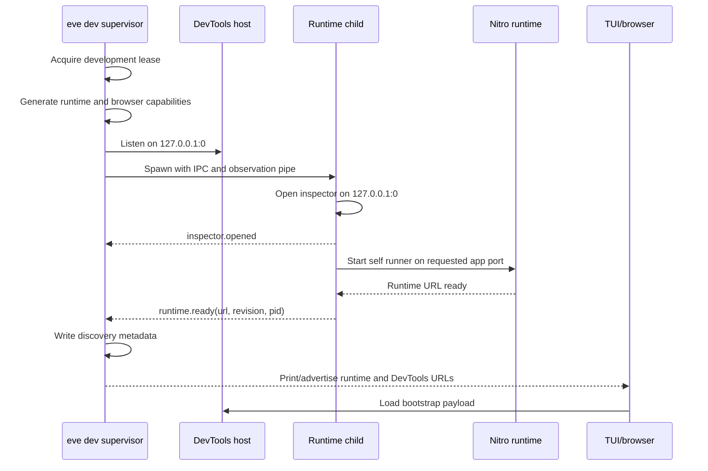
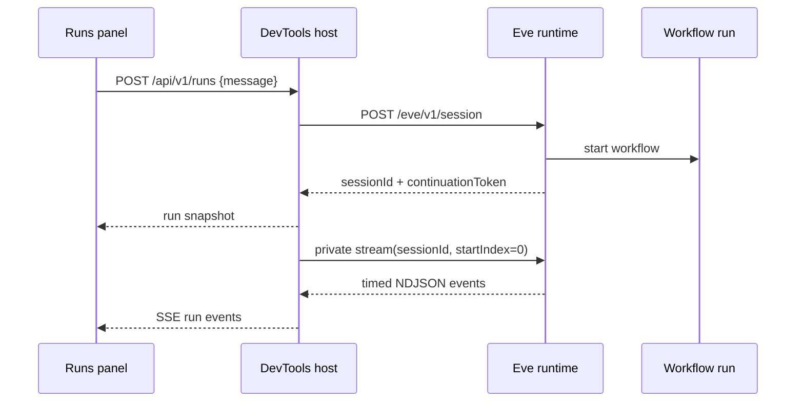
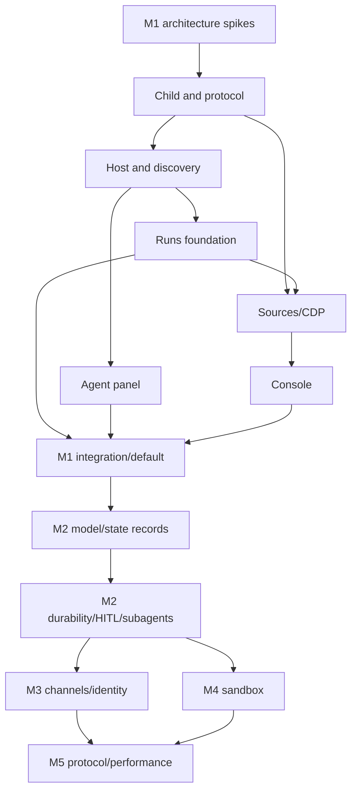

# Eve Local DevTools: Technical Design and Delivery Plan

Status: Draft  
Related PRD: [`prds/local-devtools.md`](./local-devtools.md)  
Related UX design: [`prds/local-devtools-ux-design.md`](./local-devtools-ux-design.md)

Last updated: 2026-06-19

## Summary

This document proposes the architecture and delivery plan for Eve Local DevTools. It turns the product requirements into concrete process boundaries, protocols, storage, APIs, runtime instrumentation, frontend structure, and staged implementation work.

The defining architectural decision is to separate the DevTools host from the inspected Eve runtime:

- `eve dev` supervises the local development session.
- A DevTools host in the supervisor serves the browser UI, local API, run index, logs, and Chrome DevTools Protocol relay.
- Nitro, the Workflow local world, authored agent code, and the Node inspector run in a child process.
- The terminal UI remains in the supervisor and talks to the runtime through the same HTTP client contract it uses today.

This split lets DevTools remain responsive while a breakpoint pauses the runtime. It also gives one process clear ownership of discovery metadata, ports, logs, child lifecycle, persistent inspection records, and browser clients.

Milestone 1 ships only when the complete core debug loop works: start Eve, inspect the resolved agent, create a session, follow the run, pause in authored TypeScript, inspect scopes, correlate console output, resume, and observe completion. Intermediate infrastructure PRs remain behind an internal flag and are not presented as a product milestone.

## Scope

This design covers:

- Local `eve dev` only.
- Direct interactive launches and headless launches owned by Next.js, Nuxt, and SvelteKit integrations.
- The Runs, Agent, Sources, and Console panels required by Milestone 1.
- The extension points needed for later durable-state, channel, sandbox, network, and performance milestones.
- Compatibility with the existing TUI, session protocol, runtime snapshots, source maps, and inspector flags.

This design does not cover production or remote deployment debugging.

## Current architecture

Today `eve dev` performs all local responsibilities in one process:

```text
eve CLI process
├── optional Node inspector
├── Nitro development server
│   ├── application and channel routes
│   ├── Workflow local-world routes
│   └── authored agent execution
├── authored-source and environment watchers
├── sandbox prewarm and lifecycle
└── terminal UI
```

When an inspector flag is present, Eve switches Nitro’s development runner from its default worker to `self` so runtime code executes in the inspected process. This makes authored breakpoints reliable, but a pause also freezes:

- The Nitro HTTP server
- Workflow dispatch and callbacks
- Rebuild handling
- The TUI’s event source
- Any DevTools UI served from that process

Other relevant current behavior:

- The CLI owns `.eve/dev-process.pid` and `.eve/dev-server.json` indirectly through `startDevelopmentServer()`.
- Next.js, Nuxt, and SvelteKit spawn `eve dev --no-ui --port 0` and discover the runtime URL from process output.
- `--inspect-network` relaunches the entire CLI with Node’s `--experimental-network-inspection` startup argument.
- The TUI captures same-process stdout and stderr by replacing `process.stdout.write` and `process.stderr.write`.
- The TUI only knows sessions it creates.
- Session streams are replayable when the caller already knows a session id.
- Development source maps already map immutable runtime snapshots to live authored workspace files.

## Requirements that constrain the architecture

1. The DevTools shell must remain interactive while runtime JavaScript is paused.
2. Authored breakpoints must execute in the inspected process, so Nitro must use the `self` runner there.
3. Existing TUI and framework integrations must continue to work.
4. Multiple Eve projects must run without fixed HTTP or inspector port conflicts.
5. DevTools observation must never fail or block the agent.
6. The visual UI and coding agents must use the same versioned local API.
7. Detailed session streams remain owned by the Workflow runtime; DevTools must not parse undocumented `.workflow-data` internals.
8. Eve should not add an avoidable runtime dependency to the published package.
9. The local control surface and inspector must bind to loopback by default and protect state-changing operations.
10. Runtime revision and session pinning must remain explicit throughout the system.

## Architectural decisions

### D1. Split the DevTools-enabled runtime into supervisor and child

The default DevTools path uses two processes. The existing in-process development path remains available through `--no-devtools` during rollout and parity validation.

Why:

- A process cannot serve a responsive debugger UI while its JavaScript thread is paused.
- The supervisor can capture child stdout/stderr without intercepting its own terminal rendering.
- The supervisor can keep diagnostic state after a runtime crash.
- The inspector can always use an ephemeral port without making external callers parse stderr.
- Framework integrations keep one process handle—the `eve dev` supervisor—to own and terminate.

Rejected alternatives:

- **Serve DevTools from the Nitro runtime.** The UI freezes at every breakpoint.
- **Keep the runtime in the supervisor and host only static UI elsewhere.** CDP controls may remain available, but run APIs and lifecycle handling still freeze or require another process with unclear ownership.
- **Embed Chrome DevTools without an Eve host.** It does not solve run discovery, session semantics, trigger APIs, state, or coding-agent access.

### D2. Keep the public Eve protocol canonical; add a private dev-control surface

The existing session event stream remains the canonical ordered event journal. DevTools does not invent a second event vocabulary for events already public.

The runtime child adds dev-only, capability-protected routes for supervisor use when existing user-configurable channel routes are unsuitable, particularly:

- Reading a session stream by id independent of authored channel configuration.
- Reading current runtime revision and inspection health.
- Future internal trigger/control operations that must not be public production routes.

These routes are mounted only in local development and require an internal capability generated by the supervisor.

### D3. Add supplementary inspection records instead of expanding every public event

Full model inputs, state projections, rebuild transactions, execution descriptors, and structured log correlation are valuable locally but should not automatically become stable public session events.

A dev-only observation sink emits versioned supplementary records to the supervisor. It is absent or a no-op outside local development.

### D4. The DevTools host owns the only browser-facing CDP session

The browser connects to a supervisor WebSocket. The supervisor relays CDP messages to the runtime inspector and can observe debugger state for cross-panel correlation.

Node debugger commands are stateful, so the first release supports one controlling DevTools client. Additional browser tabs are read-only for run/agent/log data and show which client owns debugger control.

The raw inspector URL remains available in owner-readable local metadata for VS Code/Chrome compatibility. Concurrent debugger controllers are not guaranteed.

### D5. Build an Eve-owned frontend over selected CDP domains

The frontend uses the `Debugger` and `Runtime` CDP domains needed by Sources and Console. It does not fork the complete Chromium DevTools frontend.

This keeps Eve primitives central, limits bundled size, and avoids coupling the product to Chromium’s panel architecture and release cadence.

### D6. Persist indexes and supplementary records, not workflow internals

The supervisor persists a small Eve-owned run index and bounded inspection records. Canonical event details are retrieved through the runtime’s session stream.

DevTools never reads `.workflow-data` files directly.

### D7. Intermediate implementation stays hidden until the core loop is complete

Milestone 1 is the first public product unit. Its implementation lands through a sequence of reviewable PRs behind an internal flag. The user-facing default changes only after the end-to-end acceptance journey passes.

## Target architecture



### Process responsibilities

#### Supervisor

- Owns the application-level dev-process lease and shutdown handling.
- Creates the private runtime capability and browser capability.
- Starts the DevTools host on loopback port `0`.
- Starts and monitors the runtime child.
- Owns `.eve/dev-process.pid` and top-level development metadata.
- Runs the TUI for direct interactive launches.
- Captures child stdout/stderr.
- Receives session-registration and supplementary inspection records.
- Reads canonical session streams through the child’s private dev route.
- Maintains browser/API subscriptions.
- Connects to and relays the Node inspector.
- Keeps the latest state available after a child pause or crash.

#### Runtime child

- Loads environment files.
- Opens the Node inspector on the requested loopback endpoint.
- Starts Nitro with `runner = "self"`.
- Owns Workflow local-world configuration and callbacks.
- Owns authored-source/environment watching.
- Owns sandbox prewarm and runtime resources.
- Publishes current runtime revision.
- Emits best-effort dev observation records.
- Serves private dev-control routes protected by the supervisor capability.
- Shuts down gracefully on supervisor request or parent disconnect.

#### Browser UI

- Reads all data through the supervisor API.
- Maintains a normalized client-side cache keyed by stable ids.
- Uses one SSE connection for append-only run/log/revision updates.
- Uses one WebSocket for CDP relay when the tab owns debugger control.
- Does not connect directly to Nitro or the raw inspector in normal operation.

## Proposed module layout

```text
packages/eve/
├── devtools-ui/
│   ├── src/
│   │   ├── app/
│   │   ├── panels/
│   │   │   ├── runs/
│   │   │   ├── agent/
│   │   │   ├── sources/
│   │   │   └── console/
│   │   ├── protocol/
│   │   └── state/
│   └── tsconfig.json
├── scripts/
│   └── build-devtools-ui.mjs
└── src/
    ├── cli/dev/
    │   ├── supervisor.ts
    │   ├── runtime-child.ts
    │   ├── runtime-child-process.ts
    │   └── development-lease.ts
    └── internal/devtools/
        ├── protocol/
        ├── host/
        ├── storage/
        ├── cdp/
        ├── runtime/
        └── redaction/
```

Recommendations:

- Keep every Node/runtime module under `src/internal/devtools`; this is not a public Eve API.
- Give the UI its own TSX build rather than widening the main `src/**/*.ts` compiler pipeline.
- Build the UI into static, hashed assets and copy them into the published `eve` package during `build:js`.
- Use React, which is already a workspace development dependency, and bundle it into the static assets so it does not become an `eve` runtime dependency.
- Prefer CodeMirror for the source viewer. Bundle it as a build-time dependency rather than exposing it at runtime.
- Use the repository’s Rolldown infrastructure for the UI build unless an initial spike proves it unsuitable.
- Wrap any WebSocket server implementation behind an Eve-owned interface. If Node’s built-ins are insufficient, vendor the minimal dependency into compiled assets rather than adding a new runtime dependency.

## Runtime child lifecycle

### Startup sequence



### Child process invocation

The supervisor spawns `process.execPath` with a package-owned internal child entrypoint and:

- `stdio[1]`: stdout
- `stdio[2]`: stderr
- `stdio[3]`: length-bounded NDJSON observation pipe
- IPC channel: low-volume control and lifecycle messages

The child entrypoint opens the inspector programmatically before importing and starting most runtime code. This preserves `--inspect`, `--inspect-wait`, and `--inspect-brk` semantics while allowing the child to report its resolved inspector URL through IPC.

`--inspect-network` moves from relaunching the full Eve CLI to adding `--experimental-network-inspection` only to the runtime child’s `execArgv`. The existing bin relaunch remains until the child path has equivalent tests, then can be removed for local DevTools launches.

### Development lease ownership

The supervisor, not the child, must own:

- `.eve/dev-process.pid`
- Top-level `.eve/dev-server.json`
- Duplicate-server detection
- User-facing stop/connect commands

`startDevelopmentServer()` should be refactored so process lease/metadata ownership is separable from Nitro lifecycle. The child receives an option indicating that the supervisor owns the lease and writes only runtime-ready data through IPC.

This prevents a connect/kill hint from naming a child that the supervisor could immediately restart and ensures framework integrations terminate the whole tree by killing the supervisor they spawned.

### Shutdown sequence

1. Supervisor stops accepting new trigger operations.
2. Supervisor asks the child to close Nitro, watchers, Workflow callbacks, and sandbox resources.
3. Child acknowledges clean shutdown and exits.
4. Supervisor closes SSE/CDP clients and the DevTools host.
5. Supervisor removes discovery metadata and releases the development lease.
6. A timeout escalates from `SIGTERM` to `SIGKILL` for a wedged child, matching the repository’s existing process-group shutdown approach.

### Runtime crash behavior

The supervisor remains alive when the child exits unexpectedly. It:

- Marks the runtime unavailable.
- Retains run history, logs, source metadata, and the final exception.
- Disables interaction/debugger commands.
- Offers a controlled restart operation.
- Updates discovery metadata after a successful restart.

Automatic restart is deferred until durable recovery behavior is verified. Milestone 1 can require an explicit restart from the UI or terminal.

## Supervisor/child protocol

### Control messages

Control messages use Node IPC and a versioned envelope:

```ts
interface DevControlMessage<TType extends string, TData> {
  version: 1;
  runtimeInstanceId: string;
  type: TType;
  data: TData;
}
```

Child-to-supervisor control messages:

- `inspector.opened`
- `runtime.starting`
- `runtime.ready`
- `runtime.stopping`
- `runtime.stopped`
- `runtime.startup-failed`
- `session.registered`
- `revision.current`

Supervisor-to-child control messages:

- `runtime.shutdown`
- `runtime.restart-requested` is handled by the supervisor, not sent to a live child.
- Later: bounded debug/test controls that cannot use HTTP safely.

### Observation records

Higher-volume supplementary records use the dedicated observation pipe:

```ts
interface DevObservationRecord<TType extends string, TData> {
  schemaVersion: 1;
  recordId: string;
  runtimeInstanceId: string;
  sequence: number;
  at: string;
  correlation?: {
    revision?: string;
    agentNodeId?: string;
    sessionId?: string;
    turnId?: string;
    turnSequence?: number;
    stepIndex?: number;
    callId?: string;
  };
  type: TType;
  data: TData;
}
```

Record families by milestone:

- Milestone 1: execution enter/exit, structured framework error, rebuild/revision activity.
- Milestone 2: model-call input/completion, dynamic resolver outcome, state checkpoint, HITL/auth lifecycle.
- Milestone 3: channel transaction and continuation re-key.
- Milestone 4: sandbox lifecycle, process, filesystem, and policy summaries.
- Milestone 5: transport and profiling summaries.

### Backpressure

Observation must not backpressure agent execution.

- The runtime writes into a bounded in-memory queue.
- Writes are asynchronous and never awaited by the agent path.
- Canonical session events are not sent through this queue.
- When full, the queue drops supplementary records by priority and emits one `observation.dropped` summary after capacity returns.
- Errors are swallowed after a once-per-process warning outside the observer itself.
- Large model/state records have explicit byte limits and truncation metadata.

Recommended initial limits:

- 1,000 queued records
- 1 MiB maximum encoded record
- High priority: session registration, revision, terminal errors
- Medium priority: model/action/state boundaries
- Low priority: verbose debug/log supplements

These values should remain internal constants until measurements justify configuration.

## Session discovery and event ingestion

### Session registration

`createWorkflowRuntime().run()` is the earliest place that knows the actual Workflow run id. After `start()` succeeds, the runtime emits `session.registered` containing:

- `sessionId`
- `runtimeInstanceId`
- Root/parent lineage when present
- Agent node id
- Channel kind/name
- Run mode
- Sanitized trigger summary
- Runtime revision
- Creation timestamp

Registration is best-effort and occurs after the workflow has successfully started, so DevTools never lists a session id that was not assigned.

### Canonical event stream

After registration, the supervisor opens a private dev-only stream route on the child with `startIndex=0`. The route reads the Workflow run by session id and returns the same timed `HandleMessageStreamEvent` objects as the public stream.

Why a private route:

- The authored/default Eve channel can be disabled, replaced, or protected by user auth.
- DevTools needs to follow sessions created by any channel or schedule.
- The supervisor and runtime are separate processes and cannot share the Workflow world’s in-memory objects safely.
- A capability-protected dev route is narrower than teaching the supervisor to impersonate every authored channel.

The supervisor assigns a delivery cursor but does not rewrite the event’s durable metadata. Browser reconnects use the supervisor cursor; runtime reconnects use the Workflow stream index.

### Coarse run status

The supervisor derives a small status machine from canonical events:

```text
starting → running → waiting → running → completed
                  ↘ failed
```

Additional orthogonal flags:

- `runtimePaused`
- `runtimeUnavailable`
- `revisionStale`
- `hasPendingInput`
- `hasPendingAuthorization`
- `waitingForChild`

The raw journal remains authoritative; this status exists for lists and navigation only.

## Storage design

### Milestone 1

Milestone 1 stores current-process runs, canonical events, CDP metadata, and logs in memory. This reduces the first release’s migration and retention surface while still supporting browser refresh during the process lifetime.

Breakpoint preferences and DevTools layout may persist locally.

### Milestone 2

Milestone 2 adds bounded filesystem-first storage:

```text
.eve/devtools/
├── current.json                 # owner-readable discovery and capability
└── v1/
    ├── runs.jsonl               # append-only run index updates
    ├── breakpoints.json
    ├── sessions/
    │   └── <encoded-session-id>/
    │       └── records.jsonl    # supplementary inspection records
    └── instances/
        └── <runtime-instance-id>.json
```

Rules:

- Only the supervisor writes these files.
- `current.json` uses owner-only permissions because it contains a local capability.
- Session ids are encoded and never used as raw relative paths.
- JSONL writes are append-only during a process lifetime.
- Startup tolerates and skips a malformed final line after a crash.
- Compaction rewrites through a temporary file and atomic rename.
- Canonical event streams stay in Workflow storage and are not duplicated wholesale.
- Deleting `.eve/devtools/` is a supported complete reset.

Recommended initial retention for supplementary data:

- Seven days
- Most recent 100 sessions
- 256 MiB total

Whichever limit is crossed first triggers oldest-first pruning, excluding active sessions.

## Discovery metadata

The existing `.eve/dev-server.json` remains the stable pointer for the active local server and should grow in a backward-compatible way:

```json
{
  "pid": 1234,
  "url": "http://127.0.0.1:2000/",
  "devtoolsUrl": "http://127.0.0.1:43123/",
  "runtimePid": 1235,
  "runtimeInstanceId": "...",
  "revision": "...",
  "updatedAt": "..."
}
```

The browser capability and raw inspector endpoint live in `.eve/devtools/current.json`, not in the broadly consumed metadata record:

```json
{
  "schemaVersion": 1,
  "appRoot": "...",
  "devtoolsUrl": "http://127.0.0.1:43123/?token=...",
  "inspectorUrl": "ws://127.0.0.1:49111/...",
  "runtimeInstanceId": "...",
  "updatedAt": "..."
}
```

Coding agents can discover this file, use its capability, and then switch to the versioned API.

Framework-specific registries (`next-dev-server.json`, `nuxt-dev-server.json`, and `sveltekit-dev-server.json`) can continue pointing only at the Eve runtime origin. They do not need to duplicate DevTools state because the app root leads to the common discovery file.

## DevTools host API

The host serves static assets and `/api/v1`. Suggested Milestone 1 surface:

### Bootstrap and health

- `GET /api/v1/health`
- `GET /api/v1/bootstrap`
  - Runtime availability
  - Runtime and DevTools versions
  - Runtime URL and instance id
  - Current revision
  - Resolved agent info
  - Debugger ownership/state

### Runs

- `GET /api/v1/runs`
- `GET /api/v1/runs/:sessionId`
- `GET /api/v1/runs/:sessionId/events?cursor=...`
- `POST /api/v1/runs`
- `POST /api/v1/runs/:sessionId/messages`
- Later: `POST /api/v1/runs/:sessionId/input-responses`

### Live updates

- `GET /api/v1/events` using Server-Sent Events
  - Run registrations and status
  - Canonical session events
  - Logs
  - Revision/rebuild changes
  - Runtime and debugger state

The browser reconnects with `Last-Event-ID`. The supervisor keeps a bounded replay buffer for the current process and tells a client to refetch snapshots when its cursor is too old.

### Source debugging

- `GET /api/v1/sources` for the normalized source tree and ownership metadata.
- `GET /api/v1/sources/:sourceId` only when CDP source retrieval is not sufficient.
- `WS /api/v1/debugger` for CDP relay.

### Console

- `GET /api/v1/logs?cursor=...`
- Console/log live updates also appear on the shared SSE feed.

### Later trigger APIs

- `POST /api/v1/schedules/:scheduleId/dispatch`
- `POST /api/v1/channels/:channelId/http`
- WebSocket channel test sessions

### Authentication

- Initial browser navigation includes a random capability token in the URL fragment or query.
- The bootstrap page moves it into in-memory client state and removes it from the visible address when possible.
- API calls use `Authorization: Bearer <capability>`.
- The debugger WebSocket uses a short-lived ticket minted through an authenticated HTTP request rather than putting the long-lived capability in the WebSocket URL.
- State-changing requests validate `Origin` in addition to the capability.
- The host binds to `127.0.0.1` by default.

## Interaction path

Milestone 1 reuses the typed Eve client and canonical session routes for message creation and continuation:



Limitations:

- This path requires the default/authored Eve session route to be available for interaction.
- Following sessions created through schedules or other channels does not require that route because the private stream is channel-independent.
- A future DevTools-owned local trigger adapter can remove the interaction dependency if agents commonly disable the Eve channel.

The host uses a separate `ClientSession` per selected conversation and serializes its state. It never infers continuation validity from UI state alone; the client session state and latest boundary event are both checked.

## Agent panel data

Milestone 1 builds the Agent panel from `GET /eve/v1/info` and current rebuild/revision records.

The supervisor should request agent info from the runtime rather than compiling the app independently. This ensures the panel describes the revision the runtime is actually serving.

Agent entries preserve:

- Runtime identity/name
- Authored/framework origin
- Active/disabled/replaced status
- Source id, logical path, export, and source kind
- Tool and output schemas
- Dynamic resolver event subscriptions
- Subagent node id and hierarchy
- Diagnostics summary

Source links are normalized by the host into a `SourceReference` shared with the Sources panel.

## Runtime revision model

Use the development runtime snapshot root/revision token as an opaque `revisionId`. Do not derive UI meaning from its path format.

The supervisor tracks:

```ts
interface RuntimeRevision {
  revisionId: string;
  status: "building" | "ready" | "failed";
  changedPaths: readonly string[];
  startedAt: string;
  completedAt?: string;
  diagnostics?: unknown;
}
```

Session registration pins the active revision id. A later rebuild updates the runtime pointer but never rewrites existing session ownership.

Sources also associate every CDP script with the revision active when `Debugger.scriptParsed` arrived. On rebuild:

- URL breakpoints are re-applied to new scripts.
- Old script ids remain associated with their original session/revision until the runtime discards them.
- A pause shows both `executionRevision` and `currentRevision`.

## Sources and CDP design

### Connection

The supervisor establishes one WebSocket client connection to the runtime inspector and exposes a mediated browser connection.

It enables:

- `Runtime`
- `Debugger`

It does not enable CPU, heap, or experimental network domains until their panels are implemented.

### Source catalog

Build the source catalog from `Debugger.scriptParsed`:

- `file://` paths inside the app/workspace source root → `authored`
- `eve://runtime/*` → `eve-runtime`
- `eve://nitro/*` → `nitro`
- Node internal URLs → `node-internal`
- `node_modules` or other external paths → `dependency`
- Generated workflow/build paths → `generated`

Authored entries are visible by default. Other ownership groups are collapsed behind a “Framework and dependencies” section.

Existing source-map normalization remains authoritative. DevTools should not implement a second snapshot-to-live-path rewrite in the browser.

### Breakpoints

- Store user intent as URL + authored line/column, not CDP script id.
- Use `Debugger.setBreakpointByUrl` so a breakpoint can bind across rebuilds.
- Show bound locations per runtime revision.
- Persist authored breakpoints in `.eve/devtools/v1/breakpoints.json`.
- Invalidate CDP `objectId` values and scope expansion immediately on resume.
- Release object groups after resume or navigation to avoid retaining runtime objects.

### Pause correlation

CDP’s `Debugger.paused` event does not know Eve session ids. Eve needs an explicit bridge.

Add a development execution descriptor stored in Eve’s active async context:

```ts
interface DevelopmentExecutionDescriptor {
  revision: string;
  agentNodeId?: string;
  sessionId?: string;
  turnId?: string;
  turnSequence?: number;
  stepIndex?: number;
  callId?: string;
  kind: "tool" | "hook" | "channel" | "dynamic-resolver" | "schedule" | "framework";
  source?: SourceReference;
}
```

Runtime wrappers install this descriptor before calling authored code. A global-symbol resolver returns only the serializable ids from the active `AsyncLocalStorage` context.

When paused, the supervisor uses `Debugger.evaluateOnCallFrame` to invoke the resolver on the top applicable frame. It records the returned descriptor beside the pause.

This must be proven with a spike before the panel architecture is committed. The spike must cover pauses:

- Before the first `await` in a tool
- After an `await` in a tool
- In a shared helper called by a tool
- In concurrent sessions
- In a hook and channel handler
- Across the Nitro/workflow bundle boundary

If Node does not preserve the active async context during call-frame evaluation, the fallback is to inject a reserved local descriptor through authored execution wrappers and inspect wrapper/async parent frames. The UI must mark any source/timestamp-based match as a candidate rather than claiming exact correlation.

Exact pause correlation is a Milestone 1 release gate for authored tools. Other callback kinds may initially show source-only correlation if their wrapper work is deferred explicitly.

### Debugger ownership

- The first tab requesting debugger control becomes the owner.
- Ownership uses a renewable short lease.
- Other tabs receive pause/source state but cannot send mutating debugger commands.
- Closing or timing out the owner releases control.
- The UI shows when an external debugger is attached or CDP relay cannot take control.

## Console and log design

Milestone 1 combines three sources:

1. `Runtime.consoleAPICalled` and `Runtime.exceptionThrown` from CDP.
2. Child stdout and stderr captured by the supervisor.
3. Eve rebuild/runtime lifecycle records.

Records share:

```ts
interface DevLogRecord {
  id: string;
  runtimeInstanceId: string;
  at: string;
  source: "console" | "stdout" | "stderr" | "eve" | "rebuild" | "sandbox";
  level: "debug" | "info" | "warn" | "error";
  text: string;
  fields?: Record<string, unknown>;
  stack?: readonly SourceLocation[];
  correlation?: DevObservationRecord<string, unknown>["correlation"];
}
```

Milestone 1 may leave raw stdout/stderr uncorrelated. CDP console events retain source locations.

Milestone 2 adds a dev-only structured console/log bridge:

- Eve’s internal logger reads the active execution descriptor.
- Authored `console.*` calls are wrapped only in the runtime child during local development.
- The wrapper preserves normal console output and sends a supplementary structured record.
- The bridge uses a monotonic id so the supervisor can de-duplicate its structured record from the equivalent CDP/stdout observation.
- Unstructured direct writes remain visible and explicitly uncorrelated.

The existing TUI log renderer can migrate to the supervisor log feed later. Milestone 1 can continue rendering child stdout/stderr through a narrow adapter.

## Model-call and state observation

These capabilities enter in Milestone 2 but their insertion points should be reserved in Milestone 1 protocol design.

### Model calls

Capture at the final model-input assembly boundary in the harness, adjacent to the existing instrumentation runtime-context path. Record before the provider call:

- Final instructions/messages
- Effective static and dynamic tools
- Active skill/instruction contributions
- Output schema
- Model reference and provider options
- Cache path and runtime identity

Complete the record with:

- Finish reason
- Usage
- Retry attempts
- Duration
- Compaction relationship
- Error id/details when failed

Do not reconstruct model input from the manifest after the turn.

### State checkpoints

Capture only after `createDurableSessionState()` has produced the committed step snapshot. Project state into ownership groups and redact before emission:

- Model-visible history
- Authored `defineState`
- Channel adapter state and projected metadata
- Harness/framework state
- Sandbox state handle

The supervisor computes diffs between adjacent committed snapshots. It never exposes a mutation endpoint in the initial milestones.

## UI architecture

### Application shell

- Static single-page application served by the supervisor.
- Hash or history routing for Runs, Agent, Sources, and Console.
- Console can also open as a persistent bottom drawer.
- One normalized store for bootstrap, runs, sources, logs, revisions, and debugger state.
- All server data is keyed by stable ids; panel-local state contains selection and presentation only.

### Data transport

- Fetch snapshots through JSON endpoints.
- Use one SSE connection for append-only updates.
- Use one CDP relay WebSocket only while a debugger controller is active.
- On SSE replay-buffer expiry, refetch affected snapshots and resume from the new cursor.

### Runs panel state

Recommended normalized entities:

- `runsBySessionId`
- `eventsBySessionId`
- `turnsById`
- `stepsByTurnAndIndex`
- `actionsByCallId`
- `pendingInputsByRequestId`
- `childrenByParentSessionId`
- `recordsByCorrelationKey`

The canonical event reducer should be shared conceptually with the TUI/client reducers but not import terminal-rendering concerns.

### Source viewer

- CodeMirror editor in read-only mode.
- Source text comes from CDP `Debugger.getScriptSource` or a safe host file endpoint for authored files.
- Gutter owns breakpoint interactions.
- Sidebars show source tree, call stack, scopes, and breakpoints.
- Paused Eve descriptor is rendered above the call stack with a “Reveal in Runs” action.

### UI asset delivery

- Build hashed JS/CSS assets during `packages/eve` build.
- Extend `copy-runtime-assets.mjs` or add a dedicated copy/build step.
- Include an asset manifest the host can read without filesystem crawling.
- Set a strict Content Security Policy; only the local API and debugger WebSocket are allowed.
- Do not load fonts, scripts, analytics, or source maps from external origins.

## Security design

### Threat model

The DevTools host can:

- Send messages and trigger work.
- Read full local agent inputs/outputs and state.
- Control a Node debugger capable of arbitrary code execution.

Loopback alone is insufficient because malicious web pages and local processes can target localhost services.

### Controls

- Random 256-bit browser capability per supervisor lifetime.
- Separate random internal runtime capability.
- Owner-only permissions for the capability discovery file.
- Loopback bind by default.
- `Origin` allow-list for browser API and WebSocket requests.
- Short-lived debugger-control tickets.
- No permissive CORS headers.
- CSP forbidding external scripts, frames, and connections.
- Constant-time capability comparison.
- Redaction before data leaves the runtime child.
- Body and record size limits.
- State-changing methods use POST and reject simple cross-origin form content types.

### Redaction

Centralize redaction in one internal package and apply it before persistence or browser delivery.

Always redact:

- Authorization, proxy-authorization, and cookie headers
- Known token/key/password/secret fields
- Connection token results
- Vercel and model-provider credentials
- Credential-brokering transform values
- Internal DevTools capabilities

Redaction is defense in depth, not permission to inspect arbitrary `process.env`. DevTools should expose allow-listed environment presence and source, never a raw environment dump.

## Compatibility and CLI behavior

### Default behavior after Milestone 1

- Local `eve dev` starts DevTools by default.
- Direct interactive launches open the DevTools URL after runtime readiness, print it, and add a TUI `/devtools` command.
- Headless/framework-owned launches never open a browser.
- `--no-devtools` uses the existing in-process development path.

### Inspector flags

- No inspector flag: DevTools child inspector uses `127.0.0.1:0`.
- `--inspect[=target]`: overrides the child inspector target and keeps DevTools enabled.
- `--inspect-wait`: the child reports its inspector URL, then waits for debugger control before starting Nitro.
- `--inspect-brk`: the child waits, then triggers the existing early debugger break.
- `--inspect-network`: adds Node’s experimental network-inspection startup flag to the child.
- `--url`: remains a remote TUI mode and does not start Local DevTools in the initial release.

### Framework integrations

Next.js, Nuxt, and SvelteKit continue spawning:

```text
eve dev --no-ui --port 0
```

The spawned supervisor prints the same parseable runtime URL as today. It also writes common DevTools discovery metadata under the agent app root. Existing framework registry formats remain valid.

## Failure handling

### DevTools host fails to start

- Warn with an actionable message.
- Continue with the existing local server/TUI path unless the user explicitly required DevTools.
- Do not leave a stale development lease or child process.

### Inspector fails to open

- Agent interaction and Agent/Runs panels can continue.
- Sources shows unavailable status and remediation.
- Explicit `--inspect-wait`/`--inspect-brk` remains a hard startup failure because the user required debugging semantics.

### Observation pipe closes

- Runtime continues.
- Canonical session streams remain available.
- Host marks supplementary inspection incomplete.
- One warning is emitted; the child does not retry unboundedly.

### Canonical stream disconnects

- Supervisor reconnects from its last runtime stream index.
- Replayed events retain original metadata and are de-duplicated by index.
- After bounded retries, the run shows “stream disconnected” rather than “failed.”

### Runtime is paused

- Host sets a global paused state from CDP.
- Interaction controls are disabled or clearly marked as queued/unavailable; Milestone 1 should reject rather than silently queue.
- Existing run/source/log history stays navigable.
- Scope objects remain valid only until resume.

### Runtime child crashes

- Host stays available with final logs and crash state.
- Development metadata marks runtime unavailable.
- Manual restart creates a new `runtimeInstanceId` and inspector connection.
- Existing run records remain read-only until streams can be recovered.

## Milestone delivery plan

Milestones are public release units. PR slices within a milestone stay behind `EVE_EXPERIMENTAL_DEVTOOLS=1` or a hidden `--devtools` option until the milestone’s acceptance criteria pass.

### Milestone 1: Core debug loop

Public outcome: inspect Agent, create and follow Runs, debug authored Sources, and read Console while the runtime can pause independently.

#### Slice 1: Architecture spikes

Purpose: retire the highest-risk assumptions before building UI.

- Spawn the runtime child with Nitro `self` runner.
- Open inspector on port `0` and report URL through IPC.
- Connect a small CDP client from the supervisor.
- Pause authored tool code while proving the supervisor remains responsive.
- Validate source-map URLs and breakpoint binding after rebuild.
- Validate exact pause correlation through the active async context.
- Prototype a private session-stream route from the supervisor.

Deliverable: tests/spike code or a short recorded fixture behind an internal flag. No user-facing surface.

Exit gate: all assumptions work, or this design is amended before further implementation.

#### Slice 2: Shared protocol and runtime child

- Add versioned control and observation types.
- Add runtime child entrypoint and lifecycle manager.
- Separate development lease ownership from Nitro lifecycle.
- Move inspector flag handling into the child path.
- Preserve the current path when the internal flag is off.
- Add unit/integration coverage for startup, failure, shutdown, and signals.

#### Slice 3: DevTools host and secure discovery

- Start loopback host on an ephemeral port.
- Generate browser/runtime capabilities.
- Write common discovery metadata with owner-only capability file.
- Serve a minimal static app shell and `/api/v1/bootstrap`.
- Add SSE infrastructure and bounded replay buffer.
- Add origin, CSP, capability, and size-limit tests.

#### Slice 4: Session registry and Runs foundation

- Emit `session.registered` after Workflow start.
- Add private capability-protected session stream route.
- Add supervisor stream pumps and current-process run index.
- Add message create/continue APIs using `eve/client`.
- Build Runs list, timeline, raw event detail, and composer.
- Reuse existing event types and current-boundary semantics.

#### Slice 5: Agent panel

- Proxy runtime `GET /eve/v1/info` through bootstrap/agent API.
- Build resolved definition tree and diagnostics.
- Normalize source references shared with Sources.
- Subscribe to runtime revision/rebuild changes.

#### Slice 6: Sources and debugger control

- Implement CDP relay and single-controller lease.
- Build source catalog and ownership filters.
- Implement source viewer, URL breakpoints, pause/step controls, call stack, and scopes.
- Persist authored breakpoint intent.
- Add execution descriptor and “Reveal in Runs.”
- Cover rebuild rebinding and stale-revision warnings.

#### Slice 7: Console and TUI adaptation

- Capture CDP console/exception events and child stdout/stderr.
- Build Console panel and drawer.
- Link stack frames to Sources.
- Feed child logs to the existing TUI through an adapter.
- Show DevTools URL and add `/devtools` command.

#### Slice 8: Integration, defaults, and release

- Exercise direct TTY, `--no-ui`, Next.js, Nuxt, and SvelteKit launches.
- Add full core-journey scenario test.
- Add two-project port-collision scenario.
- Verify `--no-devtools` fallback.
- Add package assets and size checks.
- Update CLI/runtime docs and add a changeset.
- Flip Local DevTools to default-on.
- Remove the internal milestone flag while retaining `--no-devtools`.

Milestone 1 is not complete until Slice 8 ships.

### Milestone 2: Durable agent semantics

Public outcome: explain effective model behavior, state, revisions, HITL, authorization, subagents, and schedules across durable boundaries.

#### Slice sequence

1. Model-call observation protocol and harness insertion points.
2. Model Context detail view in Runs.
3. Committed state projections, redaction, and diffs.
4. Filesystem run index and bounded inspection retention.
5. Revision/rebuild transaction history and stale-session behavior.
6. HITL response and connection-authorization lifecycle.
7. Parent/child session tree and child stream attachment.
8. Schedule trigger UI/API using the existing dev route.
9. Replay/retry/resume provenance and milestone scenario coverage.

Release gate: a developer can explain a multi-step, parked, resumed, subagent-using turn from its exact model inputs and committed state without reading raw Workflow storage.

### Milestone 3: Channel and identity debugging

Public outcome: reproduce real ingress and auth/dynamic-capability variants.

#### Slice sequence

1. Dev channel transaction observer and route catalog.
2. Raw HTTP channel request runner.
3. Verification/auth/drop/inline/dispatch transaction view.
4. Local test-principal profiles and redaction.
5. Dynamic resolver records and capability diffs.
6. Continuation-token derivation/re-key timeline.
7. WebSocket channel runner after HTTP behavior is stable.

Release gate: a realistic custom-channel request can be sent, authenticated or rejected, normalized, dispatched, and followed into its session from one linked transaction.

### Milestone 4: Sandbox debugging

Public outcome: inspect isolated execution, files, processes, policy, and persistence.

#### Slice sequence

1. Eve-owned sandbox observation interface shared by backends.
2. Lifecycle/backend/template/session records.
3. Read-only filesystem API and browser.
4. Command/process history and output.
5. Network-policy and credential-transform presence.
6. Parent/child sharing and ownership model.
7. Docker, microsandbox, just-bash, and Vercel Sandbox fixture coverage where available.

Release gate: a failed sandbox command can be explained from its owning action, backend lifecycle, filesystem, output, and network policy without implying Node debugger access.

### Milestone 5: Protocol and performance diagnostics

Public outcome: diagnose transport, concurrency, retry/replay, latency, tokens, and optional Node profiles.

#### Slice sequence

1. Move existing `--inspect-network` support behind the runtime-child CDP relay.
2. Network panel for runtime Node requests.
3. Eve HTTP/WebSocket/session-stream transaction records.
4. Stream reconnect/cursor/buffering views.
5. Controlled concurrent delivery and causality timeline.
6. Duration/token/retry/cache/compaction aggregation.
7. Optional CPU/heap profiling after explicit memory/size review.

Release gate: transport failures and concurrency behavior can be distinguished from agent failures, and the dominant time/token contributor is visible on a representative complex run.

## Dependency graph



Agent UI work can proceed alongside Runs after bootstrap and source-reference contracts stabilize. Sources depends on the process/CDP spike and enough Runs identity to validate cross-panel correlation.

## Verification plan

### Unit tests

- Protocol envelopes and schema-version rejection.
- Capability/origin validation and redaction.
- Run-status reducer and event de-duplication.
- Source ownership and URL normalization.
- Breakpoint intent/rebinding reducer.
- Log normalization and duplicate merging.
- Storage encoding, malformed-tail recovery, pruning, and atomic compaction.

### Integration tests

- Supervisor/child readiness, startup failure, shutdown, and crash behavior.
- Development lease ownership and stale metadata cleanup.
- Observation queue backpressure/drop behavior.
- Private session-stream capability and reconnect.
- Browser API authorization and SSE replay.
- CDP request/response relay and controller lease.
- Framework auto-spawn discovery metadata.

### Scenario tests

Milestone 1 scenario:

1. Start fixture with DevTools.
2. Discover host through `.eve/devtools/current.json`.
3. Load Agent data.
4. Create a session through the API.
5. Observe message, step, action request, and action result.
6. Set a breakpoint in the authored tool.
7. Send another turn.
8. Assert runtime paused and host still answers health/bootstrap.
9. Inspect execution descriptor and one local scope.
10. Resume and observe the turn boundary.
11. Stop supervisor and verify child/metadata cleanup.

Additional scenarios:

- Rebuild and breakpoint rebinding.
- Two projects with ephemeral runtime/DevTools/inspector ports.
- Runtime crash with host retained.
- `--no-devtools` current-path parity.
- Next.js/Nuxt/SvelteKit headless spawn.
- `--inspect-wait`, `--inspect-brk`, and `--inspect-network` compatibility.

Browser UI verification should use the repository’s browser-automation skill/CLI against a deterministic fixture and check console errors, keyboard navigation, and core visual states.

### Test execution expectations

Changes to the CLI, compiler/runtime, dev server, or scenario fixtures require the repository’s unit, integration, scenario, typecheck, lint, format, and build gates described in `AGENTS.md`. Relevant fixture evals remain necessary for agent-affecting work, but source/debugger protocol tests should use deterministic models and must not depend on paid model calls.

## Rollout plan

### Internal development

- Hide work behind `EVE_EXPERIMENTAL_DEVTOOLS=1` or a non-documented `--devtools` option.
- Dogfood against the weather and agent-tools fixtures.
- Keep the current direct inspector flags working.

### Opt-in preview

- Expose `--devtools` publicly for a short compatibility window once the core journey passes.
- Collect explicit developer feedback on startup time, source binding, pause behavior, and TUI coexistence.
- Do not call the milestone complete yet.

### Default-on release

- Make DevTools the default local path.
- Add `--no-devtools` escape hatch.
- Open DevTools automatically for direct interactive launches after runtime readiness.
- Document local data, capability, and debugger security.
- Monitor package size and startup regression in CI.

### Post-release cleanup

- Remove obsolete same-process inspector orchestration only after `--no-devtools` is no longer required for parity or diagnosis.
- Consolidate TUI and DevTools log capture once structured logging is stable.
- Revisit whether all local dev launches can use the supervisor/child topology without a fallback.

## Operational budgets

Initial targets for Milestone 1:

- DevTools host ready within 500 ms beyond existing runtime preparation, excluding the runtime’s normal compile/build time.
- Added published package assets below 2 MiB compressed; changes above this require explicit review.
- In-memory event/log replay buffer below 32 MiB by default.
- No more than one CDP connection from the supervisor to the runtime.
- No agent-path `await` introduced solely for supplementary inspection.
- Browser initial shell usable within one second after host response on a local machine.

These are design targets, not public guarantees. CI should record trends before enforcing hard thresholds.

## Open technical questions

1. Does `Debugger.evaluateOnCallFrame` preserve Eve’s active `AsyncLocalStorage` context after every relevant `await` boundary?
2. Which WebSocket implementation best satisfies the relay without adding a published runtime dependency?
3. Should the browser capability arrive in a URL fragment, query, or one-time bootstrap code printed by the CLI?
4. Can the existing TUI run unchanged in the supervisor once all runtime stdout/stderr originates from a child?
5. Should Milestone 1 proxy the runtime’s `/eve/v1/info`, or should the child publish the info snapshot with `runtime.ready` to avoid a second request?
6. How should external VS Code attachment interact with the DevTools host’s single CDP controller?
7. Does the Workflow local world keep every historical session stream readable after a runtime-child restart in all supported launch modes?
8. Should a child crash preserve the same runtime HTTP port on manual restart, or may metadata update to a new port?
9. What exact fields in authored state need semantic redactors beyond generic key/header redaction?
10. Can Node’s experimental network inspection be enabled only in the runtime child without changing current bin bootstrap behavior on every supported Node version?

The architecture-spike slice must answer questions 1, 2, 4, 6, and 10 before Milestone 1 implementation proceeds past its shared protocol.

## Deferred decisions

- Production/remote DevTools transport and authentication.
- Arbitrary Node evaluation in Console.
- Editable durable state.
- Replay controls that intentionally re-execute a completed step.
- Multi-user debugger collaboration.
- Browser extension or desktop-shell packaging.
- CPU/heap profiling UX.
- Cross-project session aggregation.

## Expected repository impact

Milestone 1 will likely touch:

- CLI bootstrap and `eve dev` orchestration
- Development server lease and metadata ownership
- Nitro dev-only route registration
- Workflow runtime session registration
- Internal logging and TUI log input
- Package build scripts and static assets
- Client/session event reducers
- Source-map and inspector integration tests
- Framework dev-server integration tests
- Documentation and a published `eve` changeset

The design intentionally avoids changing public agent authoring APIs in Milestone 1. New public APIs should be proposed separately if later channel/sandbox inspection requires author-provided fixtures or adapters.
